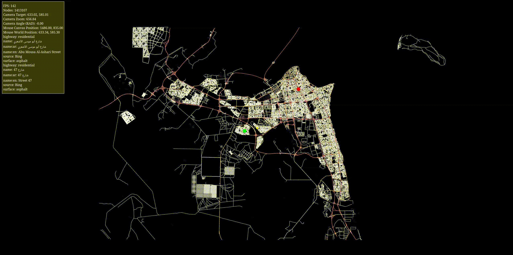
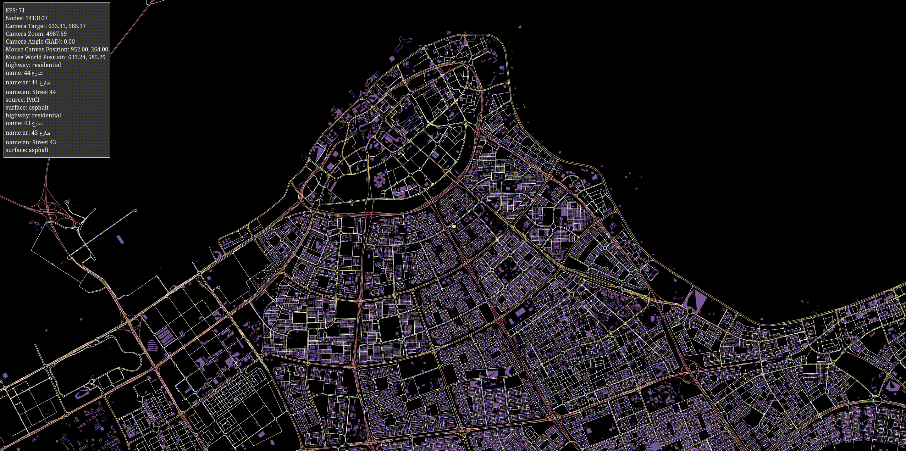
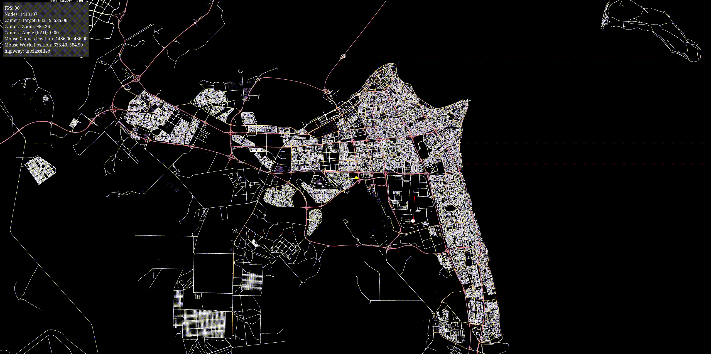

# Open street maps WebGL
This is an educational project that aims to render and act on the Open Street Maps (OSM) data.
The data is parsed then rendered on the browser using WebGL2. The project allows you to apply dijkstra algorithm
on starting/ending nodes defined by `left` mouse clicks. First being the start node (green), second being the end node (red).

You can zoom in and out using the mouse wheel. You can also rotate the map using `ctrl` and moving the mouse while holding `left` mouse button.

To start the algorithm, simply select the nodes, then press `space` on the keyboard.

The algorithm runs in a seperate worker to not block the UI thread.

# How does it work?
The data is processed as nodes. Each node is a point in earth coordinates (longitude, latitude). The distance between the nodes (read coordinates) is computed using the [haversine formula](https://en.wikipedia.org/wiki/Haversine_formula). A graph is built as an adjacency matrix, and the weights are simply the distances compued using haversine formula. The graph is built with partial data that only represents the highways with specific values to avoid running the algorithm on pedestrain/walk-only/private spaces nodes, while not perfect, it tends to do roughly a great job in determining the closest path.

The rendering is done using WebGL. A camera is implemented to apply basic linear algebra transformations (Rotation, scaling and translation). The transformation matrix is then applied to each vertex in the data using shaders. The nodes are projected from WGS84 to Web Mercator Projection (The same projection that google maps / OSM uses) to a world of 1000x1000.

```
WGS84 => Web Mercator => Custom Square Space (1000x1000)
```

An inverse matrix logic is implemented to find the mouse coordinates within the space. A quad tree data structure is then used for spatial search, mainly to find the closest node the mouse is nearby for highlighting/selection purposes.

Dijkstra algorithm is implemented using a priority queue. The algorithm runs in a seperate worker and it sends the data to the main rendering thread in batches for performance.

All the math (Matrices, vectors) are implemented from scratch for educational purposes.

# How can i run the project?
- You can view the project on https://moalhaddar.github.io/openstreetmaps-webgl/

Or manually:
- `git clone this repo`
- `yarn`
- `yarn start`

# How can i supply my own data?
You can do so by downloading an [OSM extract](https://wiki.openstreetmap.org/wiki/Planet.osm) as a protobuf file and replace it with [./assets/kuwait.pbf](./assets/kuwait.pbf). You can use [BBBike extract](https://extract.bbbike.org/) service to help you do that easily 

If you haven't worked with OSM before, [i heavily encourage you to do so,](https://wiki.openstreetmap.org/wiki/Main_Page) as you will learn a lot.

# Couldn't you use three.js instead of WebGL?
I could, but then where's the fun and the learning experience of the foundational tools that powers our devices?

# Screenshots / Videos

|  |
|:--:|
| Rendering the data, Kuwait PBF extract, 484911 edges graph. Takes 400ms to find a path in a graph of that size. |


|  |
|:--:|
| Green is starting node, red is target node.

|  |
|:--:|
| Algorithm in action


|  |
|:--:|
| From Kaifan to Kuwait City

|  |
|:--:|
| From Salmiya to Kabd

# References:
- https://webglfundamentals.org
- https://extract.bbbike.org/
- https://web.dev/articles/module-workers
- https://www.sitepen.com/blog/using-webassembly-with-web-workers
- https://github.com/lemire/FastPriorityQueue.js
- https://github.com/raysan5/raylib
- https://en.wikipedia.org/wiki/Quadtree
- http://www.movable-type.co.uk/scripts/latlong.html

# Author
Mohammed Alhaddar
