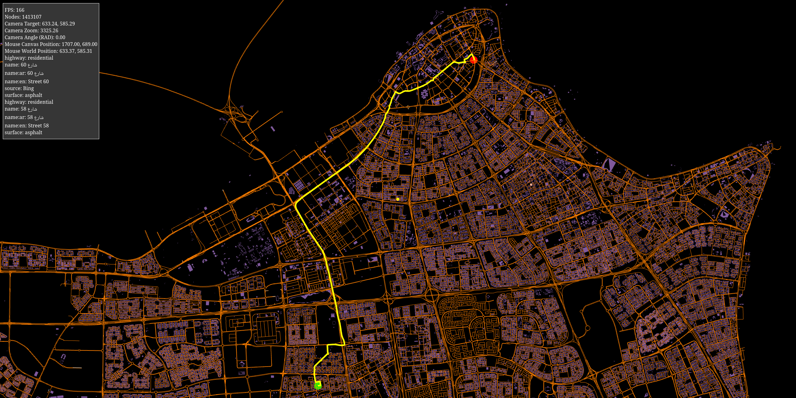

# Open street maps WebGL
This is an educational project that aims to render and act on the Open Street Maps (OSM) data.
The data is parsed then rendered on the browser using WebGL2. The project allows you to apply dijkstra algorithm
on starting/ending nodes defined by `left` and `right` mouse clicks respectively. The algorithm runs in a seperate worker
to not block the UI thread.

To start the algorithm, simply select the nodes, then press `space` on the keyboard.

# How can i run the project?
- You'll need a browser
- You'll need to transpile the ts files into js using `yarn watch` command.
- Open `index.html` in your browser and enjoy.

# How can i supply my own data?
You can do so by downloading an [OSM extract](https://wiki.openstreetmap.org/wiki/Planet.osm) and replace it with [./assets/area.osm](./assets/area.osm). 

If you haven't worked with OSM before, [i heavily encourage you to do so,](https://wiki.openstreetmap.org/wiki/Main_Page) as you will learn a lot.

# Couldn't you use three.js instead of WebGL directly?
I could, but then where's the fun and the learning experience of the foundational tools that powers our devices?

# Screenshots / Video

|  |
|:--:|
| Rendering the data, works smoothly *for this graph at least*, 200MB XML extract, 816234 edges graph. Takes 600ms to find a path in a graph of that size. |

|  |
|:--:|
| Green is starting node, red is target node, yellow is the dijkstra algorithm output |

| https://github.com/moalhaddar/openstreetmaps-webgl/raw/master/assets/output.mp4 |
|:--:|
| Algorithm in action.|

# References:
- https://webglfundamentals.org
- https://extract.bbbike.org/
- https://web.dev/articles/module-workers
- https://www.sitepen.com/blog/using-webassembly-with-web-workers
- https://github.com/lemire/FastPriorityQueue.js
- https://github.com/raysan5/raylib

# Author
Mohammed alhaddar
