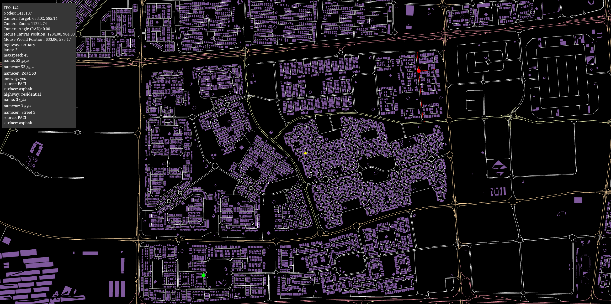

# Open street maps WebGL
This is an educational project that aims to render and act on the Open Street Maps (OSM) data.
The data is parsed then rendered on the browser using WebGL2. The project allows you to apply dijkstra algorithm
on starting/ending nodes defined by `left` mouse clicks. The algorithm runs in a seperate worker to not block the UI thread.

To start the algorithm, simply select the nodes, then press `space` on the keyboard.

# How can i run the project?
- You'll need a browser
- You'll need to serve webpack dev server using `yarn start`

# How can i supply my own data?
You can do so by downloading an [OSM extract](https://wiki.openstreetmap.org/wiki/Planet.osm) as a protobuf file and replace it with [./assets/kuwait.pbf](./assets/kuwait.pbf). You can use [BBBike extract](https://extract.bbbike.org/) service to help you do that easily 

If you haven't worked with OSM before, [i heavily encourage you to do so,](https://wiki.openstreetmap.org/wiki/Main_Page) as you will learn a lot.

# Couldn't you use three.js instead of WebGL?
I could, but then where's the fun and the learning experience of the foundational tools that powers our devices?

# Screenshots / Videos

|  |
|:--:|
| Rendering the data, Kuwait PBF extract, 484911 edges graph. Takes 400ms to find a path in a graph of that size. |

|  |
|:--:|
| Green is starting node, red is target node.

|  |
|:--:|
| Algorithm in action

|  |
|:--:|
| From Kaifan to Kuwait City

|  |
|:--:|
| From Salmiya to Kabd

# References:
- https://webglfundamentals.org
- https://extract.bbbike.org/
- https://web.dev/articles/module-workers
- https://www.sitepen.com/blog/using-webassembly-with-web-workers
- https://github.com/lemire/FastPriorityQueue.js
- https://github.com/raysan5/raylib
- https://en.wikipedia.org/wiki/Quadtree

# Author
Mohammed Alhaddar
